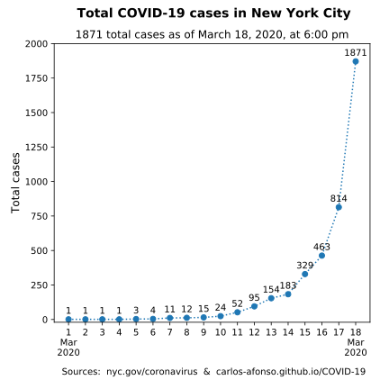
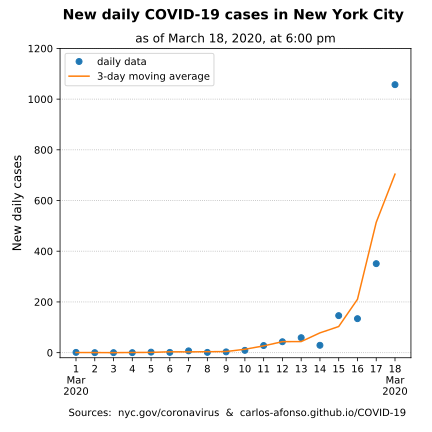

# Visualizing COVID-19

(Updated by <a href="https://www.linkedin.com/in/carlos-afonso-w" target="&#95;blank" rel="noopener">Carlos Afonso</a> on March 19, 2020)

Visualizing the Coronavirus Disease 2019 (COVID-19).

## New York City (NYC)

### NYC's latest numbers

**March 19, 2020, 5:30 pm:** The New York City Health Department [COVID-19 Daily Data Summary](https://www1.nyc.gov/assets/doh/downloads/pdf/imm/covid-19-daily-data-summary.pdf) says that there are 3,954 total confirmed COVID-19 cases in NYC.

**March 19, 2020:** [Press release](https://www1.nyc.gov/office-of-the-mayor/news/166-20/mayor-de-blasio-nyc-health-hospitals-expand-appointment-only-covid-19-testing-capacity) from the "Office of the Mayor" says:

> *Citywide, there are 3,615 positive cases of COVID-19 and 22 fatalities. Currently, there are 980 cases in Queens, 976 in Manhattan, 1030 in Brooklyn, 436 in the Bronx, and 165 in Staten Island.*
>
> *As of 5PM on March 18th, there were 554 people hospitalized with 169 of those people in the ICU.*

**March 19, 2020, 1:20 pm:** New York State Health Department's [County by County Breakdown of Positive Cases](https://coronavirus.health.ny.gov/county-county-breakdown-positive-cases) says that NYC has 2,469 positive cases.

### NYC charts

**Note (March 20):** The charts below are from March 18. I'll replace them with a more updated version soon.

The number of COVID-19 cases in NYC (as reported by the NYC Health Dep.) started growing at a faster pace in the last few days. In particular, it more than doubled from yesterday (Mar 17) to today (Mar 18): from 814 to 1871 cases. However, this was fairly expected because 1) this is the expected behavior in the beginning (then the growth should slow down at some point and the curve will form a plateau), and 2) we were behind on the testing (hopefully there is more testing being done now and we'll get better data). Note that this data is about the number of NYC residents tested positive for COVID-19 and, in addition to the delayed testing, this data has another important limitation: the daily attribution of cases is not perfect because 1) it can take more than one day to know the result of a particular test, and 2) the data is not updated at the same time every day.

While the chart above shows the total cumulative number of cases (over time), the chart below shows the number of new daily cases. As already mentioned above, the daily attribution is not perfect. So, in addition to the data points, the chart also shows the 3-day moving average to provide a more reasonable representation.

The data used to create the charts above was collected from the [NYC Health Department Coronavirus webpage](https://www1.nyc.gov/site/doh/health/health-topics/coronavirus.page){:target="&#95;blank" rel="noopener"}.

The data and code used to create the charts above are available [here](https://github.com/carlos-afonso/COVID-19){:target="&#95;blank" rel="noopener"}.

This webpage is part of the [COVID-19 open-source project](https://github.com/carlos-afonso/COVID-19){:target="&#95;blank" rel="noopener"}, created by [Carlos Afonso](https://www.linkedin.com/in/carlos-afonso-w){:target="&#95;blank" rel="noopener"}.
