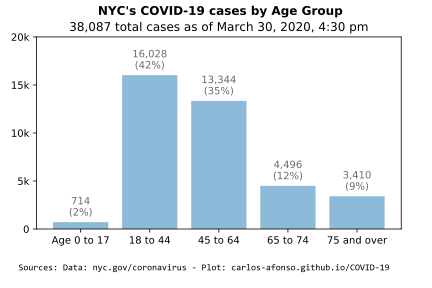
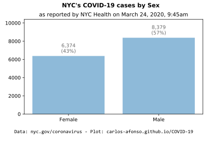

# Visualizing COVID-19

(Updated by <a href="https://www.linkedin.com/in/carlos-afonso-w" target="&#95;blank" rel="noopener">Carlos Afonso</a> on March 25, 2020)

Visualizing the Coronavirus Disease 2019 (COVID-19), particularly in New York City (NYC).

## New York City (NYC)

### Important notes

It's important to keep the following points in mind when looking at the data/plots below about the COVID-19 situation in NYC:

* The data is from the [COVID-19 Daily Data Summary](https://www1.nyc.gov/assets/doh/downloads/pdf/imm/covid-19-daily-data-summary.pdf){:target="&#95;blank" rel="noopener"} updates from the New York City Health Department.

* The data in preliminary and subject to change as cases continue to be investigated.

* The data includes all cases treated in NYC, regardless of  residence status (i.e., it includes cases in NYC residents and foreign residents treated in NYC facilities).

* Usually, the data is updated daily, up to twice a day, once in the morning (11 am) and once in the evening (7 pm). This webpage is updated every evening, with the evening (7 pm) data update, so that the plots show the data as of the end of the day. Each plot explicitly states the date/time of the data being displayed.

### NYC latest numbers

Latest COVID-19 numbers in NYC, according to the [COVID-19 Daily Data Summary](https://www1.nyc.gov/assets/doh/downloads/pdf/imm/covid-19-daily-data-summary.pdf){:target="&#95;blank" rel="noopener"} updates from the New York City Health Department:

| Update Date | New Cases | Total Cases | Total Hospitalizations | Total Deaths |
| :---------------- | ---: | -----: | ------------: | ---------: |
| March 25, 5:30 pm | 4,414| 20,011 | 3,922 (19.6%) | 280 (1.4%) |
| March 24, 5:00 pm | 2,482| 15,597 | 2,883 (18.5%) | 192 (1.2%) |

Note: The plots below show the data from March 25, 2020, 5:30 pm. The plots are updated every evening (with the end-of-day data update).

### NYC cases over Time

### NYC cases by Age Group

### NYC cases by Sex

### NYC cases by Borough

### NYC official data and information sources

New York City Department of Health:
* [COVID-19 webpage](https://www1.nyc.gov/site/doh/health/health-topics/coronavirus.page){:target="&#95;blank" rel="noopener"}
* [COVID-19 Daily Data Summary - Total Cases (.pdf)](https://www1.nyc.gov/assets/doh/downloads/pdf/imm/covid-19-daily-data-summary.pdf){:target="&#95;blank" rel="noopener"}
* [COVID-19 Daily Data Summary - Deaths (.pdf)](https://www1.nyc.gov/assets/doh/downloads/pdf/imm/covid-19-daily-data-summary-deaths.pdf){:target="&#95;blank" rel="noopener"}
* [COVID-19 Daily Data Summary - Hospitalizations (.pdf)](https://www1.nyc.gov/assets/doh/downloads/pdf/imm/covid-19-daily-data-summary-hospitalizations.pdf){:target="&#95;blank" rel="noopener"}

New York State Department of Health:
* [COVID-19 webpage](https://coronavirus.health.ny.gov){:target="&#95;blank" rel="noopener"}
* [County Breakdown of Positive COVID-19 Cases](https://coronavirus.health.ny.gov/county-county-breakdown-positive-cases){:target="&#95;blank" rel="noopener"}
* [Press Releases](https://health.ny.gov/press/releases/2020/index.htm){:target="&#95;blank" rel="noopener"}

Office of the Mayor of New York City:
* [Latest News](https://www1.nyc.gov/office-of-the-mayor/news.page){:target="&#95;blank" rel="noopener"}

The data used to create the charts above was collected from the New York City Health Department's [COVID-19 Daily Data Summary](https://www1.nyc.gov/assets/doh/downloads/pdf/imm/covid-19-daily-data-summary.pdf){:target="&#95;blank" rel="noopener"} updates.

---

This webpage is part of the [COVID-19 open-source GitHub project](https://github.com/carlos-afonso/COVID-19){:target="&#95;blank" rel="noopener"}, created by [Carlos Afonso](https://www.linkedin.com/in/carlos-afonso-w){:target="&#95;blank" rel="noopener"}.
