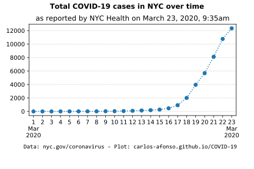
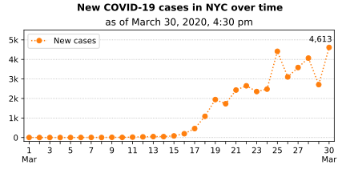

# Visualizing COVID-19

(Updated by <a href="https://www.linkedin.com/in/carlos-afonso-w" target="&#95;blank" rel="noopener">Carlos Afonso</a> on March 23, 2020)

Visualizing the Coronavirus Disease 2019 (COVID-19), particularly in New York City (NYC).

## New York City (NYC)

### NYC latest numbers

As of 5 pm on March 23, 2020, there are **13,119 cases and 125 deaths in NYC**, according to the [COVID-19 Daily Data Summary](https://www1.nyc.gov/assets/doh/downloads/pdf/imm/covid-19-daily-data-summary.pdf){:target="&#95;blank" rel="noopener"} from the New York City Health Department.

<!---
March 22, 2020: [News article](https://www1.nyc.gov/office-of-the-mayor/news/178-20/mayor-de-blasio-nypd-prepare-enforce-new-guidelines) from the Office of the Mayor of New York City says:
> _As of 10:00 AM today, citywide, there are **9,654 positive cases of COVID-19 and 63 fatalities**. Currently there are 2,715 cases in Queens 2,072 in Manhattan, 2,857 in Brooklyn, 1,411 in the Bronx, and 593 in Staten Island. There are 63 confirmed COVID-related fatalities._

March 21, 2020, 4:14 pm: **6,211 cases in NYC**, according to New York State Health Department's [County Breakdown of COVID-19 Positive Cases](https://coronavirus.health.ny.gov/county-county-breakdown-positive-cases){:target="&#95;blank" rel="noopener"}.
--->

### NYC cases over time

Note that today's (March 23) data is incomplete because it's only as of 9:35 am. This is particularly relevant when looking at the trends in the plots below (total and new cases over time), because the last data point (in both plots) is very likely to go up once we get the data for the full day.

<!---

--->

### NYC cases by Age Group

### NYC cases by Sex

### NYC cases by Borough

### NYC official data and information sources

New York City Department of Health:
* [COVID-19 webpage](https://www1.nyc.gov/site/doh/health/health-topics/coronavirus.page){:target="&#95;blank" rel="noopener"}
* [COVID-19 Daily Case Data Summary (.pdf)](https://www1.nyc.gov/assets/doh/downloads/pdf/imm/covid-19-daily-data-summary.pdf){:target="&#95;blank" rel="noopener"}
* [COVID-19 Daily Death Data Summary (.pdf)](https://www1.nyc.gov/assets/doh/downloads/pdf/imm/covid-19-daily-data-summary-deaths.pdf)

New York State Department of Health:
* [COVID-19 webpage](https://coronavirus.health.ny.gov){:target="&#95;blank" rel="noopener"}
* [County Breakdown of Positive COVID-19 Cases](https://coronavirus.health.ny.gov/county-county-breakdown-positive-cases){:target="&#95;blank" rel="noopener"}
* [Press Releases](https://health.ny.gov/press/releases/2020/index.htm){:target="&#95;blank" rel="noopener"}

Office of the Mayor of New York City:
* [Latest News](https://www1.nyc.gov/office-of-the-mayor/news.page){:target="&#95;blank" rel="noopener"}

The data used to create the charts above was collected from the New York City Health Department's [COVID-19 Daily Data Summary](https://www1.nyc.gov/assets/doh/downloads/pdf/imm/covid-19-daily-data-summary.pdf){:target="&#95;blank" rel="noopener"}.

---

This webpage is part of the [COVID-19 open-source project](https://github.com/carlos-afonso/COVID-19){:target="&#95;blank" rel="noopener"}, created by [Carlos Afonso](https://www.linkedin.com/in/carlos-afonso-w){:target="&#95;blank" rel="noopener"}.
