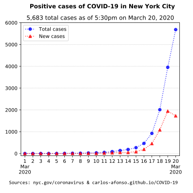

# Visualizing COVID-19

(Updated by <a href="https://www.linkedin.com/in/carlos-afonso-w" target="&#95;blank" rel="noopener">Carlos Afonso</a> on March 22, 2020)

Visualizing the Coronavirus Disease 2019 (COVID-19), particularly in New York City (NYC).

## New York City (NYC)

### NYC latest numbers

March 21, 2020, 5:30 pm: **8,115 cases and 60 deaths in NYC**, according to New York City Health Department's [COVID-19 Daily Data Summary](https://www1.nyc.gov/assets/doh/downloads/pdf/imm/covid-19-daily-data-summary.pdf){:target="&#95;blank" rel="noopener"}.

<!---
March 21, 2020, 4:14 pm: **6,211 cases in NYC**, according to New York State Health Department's [County Breakdown of COVID-19 Positive Cases](https://coronavirus.health.ny.gov/county-county-breakdown-positive-cases){:target="&#95;blank" rel="noopener"}.
--->

### NYC cases over time

### NYC cases by age group

### NYC official data and information sources

New York City Department of Health:
* [COVID-19 webpage](https://www1.nyc.gov/site/doh/health/health-topics/coronavirus.page){:target="&#95;blank" rel="noopener"}
* [COVID-19 Daily Data Summary (.pdf)](https://www1.nyc.gov/assets/doh/downloads/pdf/imm/covid-19-daily-data-summary.pdf){:target="&#95;blank" rel="noopener"}

New York State Department of Health:
* [COVID-19 webpage](https://coronavirus.health.ny.gov){:target="&#95;blank" rel="noopener"}
* [County Breakdown of Positive COVID-19 Cases](https://coronavirus.health.ny.gov/county-county-breakdown-positive-cases){:target="&#95;blank" rel="noopener"}
* [Press Releases](https://health.ny.gov/press/releases/2020/index.htm){:target="&#95;blank" rel="noopener"}

Office of the Mayor of New York City:
* [Latest News](https://www1.nyc.gov/office-of-the-mayor/news.page){:target="&#95;blank" rel="noopener"}

The data used to create the charts above was collected from the New York City Health Department's [COVID-19 Daily Data Summary](https://www1.nyc.gov/assets/doh/downloads/pdf/imm/covid-19-daily-data-summary.pdf){:target="&#95;blank" rel="noopener"}.

---

This webpage is part of the [COVID-19 open-source project](https://github.com/carlos-afonso/COVID-19){:target="&#95;blank" rel="noopener"}, created by [Carlos Afonso](https://www.linkedin.com/in/carlos-afonso-w){:target="&#95;blank" rel="noopener"}.
