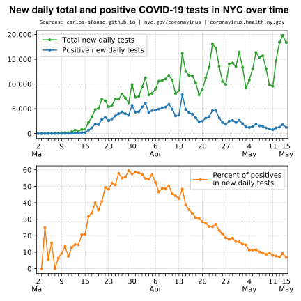
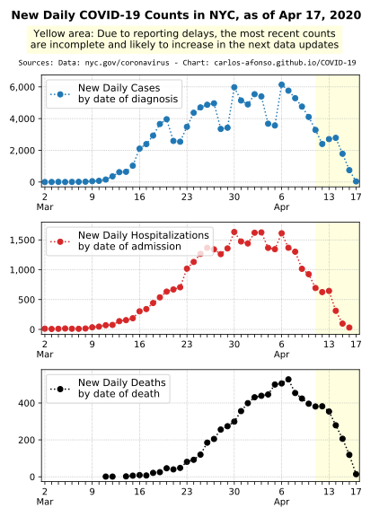
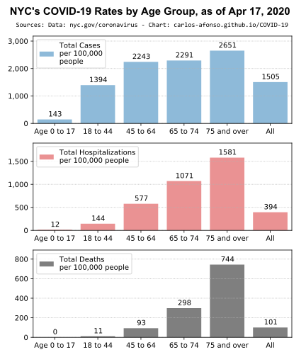

# Visualizing COVID-19 in NYC

<i>(Updated on April 13, 2020, by <a href="https://www.linkedin.com/in/carlos-afonso-w" target="&#95;blank" rel="noopener">Carlos Afonso</a>, a Data Scientist in NYC)</i>

Data visualizations to help understand the evolution of the Coronavirus Disease 2019 (COVID-19) here in New York City (NYC).

## 1. Percent of positive COVID-19 tests over time

The **"percent of positive COVID-19 tests over time"** is arguably the best metric to help understand the evolution of the disease here in NYC, because:
* It's a simple metric, defined as the *"number of people who tested positive for COVID-19"* divided by the *"number of all people tested for COVID-19"*. (Note: the result of this division is multiplied by 100 to transform it from a ratio to a percentage.)
* By definition, this metric takes into consideration both the *"number of positive tests"* and the *"number of total tests"*. This is important because the number of (total) tests performed has not been constant over time.

The chart below shows two complementary versions of this important metric, namely:
* The **"percent of new daily positive COVID-19 tests by test date"** (in orange) defined as the *"number of (new) people who tested positive for COVID-19 (on that day)"* divided by the *"number of all people tests for COVID-19 (on that day)"*. This version shows the short temporal trend, i.e., the daily fluctuations.
* The **"percent of cumulative positive COVID-19 tests as of test date"** (in purple) defined as the *"number of all people who tested positive for COVID-19 (up to that day)"* divided by the *"number of all people tests for COVID-19 (up to that day)"*. This version shows the long term trend.

The two lines/metrics in the chart above are explained in more detail in the next two charts (sections 1.1 and 1.2).

### 1.1. Percent of new daily positive COVID-19 tests over time

The next figure has two charts. The first/top chart shows both the *"number of new daily total COVID-19 tests"* (in green) and the *"number of new daily positive COVID-19 tests"* (in blue) *"by test date"*. There has been a progressive increase in the number of total tests over time. The number of positives has grown along with the number of total tests (which is expected). However, a piece of good news is that, when compared with the total tests (green line), the new positives (blue line) seems to have been growing at a lower pace recently. This important piece of information is better captured in the figure's second/bottom chart.

Indeed, the second/bottom chart shows the **"percent of new daily positive COVID-19 tests by test date"** (in orange) which is defined has the *"number of new daily positive COVID-19 tests"* divided by the *"number of new daily total COVID-19 tests"* (i.e., the ratio of the two lines in the first chart: the blue line divided by the green line) -- multiplied by 100 to transform the ratio into a percentage. Note how after an initial progressive increase, the percent of new positive tests (orange line) has been decreasing recently. This is the same piece of good news as already seen in the first/top chart, but now the second/bottom chart makes it more clear.

### 1.2. Percent of cumulative positive COVID-19 tests over time

The next figure is the cumulative version of the previous figure.

The next figure has two charts. The first/top chart shows both the *"number of cumulative total COVID-19 tests"* (in green) and the *"number of cumulative positive COVID-19 tests"* (in blue) *"as of the test date"*. There has been a progressive increase in the number of total tests (green) over time. The number of positives (blue) has grown along with the number of total tests (as expected). However, a piece of good news is that, when compared with the total tests (green line), the new positives (blue line) seems to have been growing at a lower pace recently. This important piece of information is better captured in the figure's second/bottom chart.

Indeed, the second/bottom chart shows the **"percent of cumulative positive COVID-19 tests as of the test date"** (in orange) which is defined has the *"number of cumulative positive COVID-19 tests"* divided by the *"number of cumulative total COVID-19 tests"* (i.e., the ratio of the two lines in the first chart: the blue line divided by the green line) -- multiplied by 100 to transform the ratio into a percentage. Note how after an initial progressive increase, recently, the percent of new positive tests (purple line) stabilized and seems to be starting to decline. This is the same piece of good news as in the first/top chart, but now the second/bottom chart makes it more clear.

## 2. New daily COVID-19 cases, hospitalizations, and deaths over time

The chart below shows the new daily COVID-19 cases (i.e., positive tests), hospitalizations, and deaths in NYC.

## 3. Demographic breakdowns of COVID-19 in NYC

### 3.1. COVID-19 rates by age group

### 3.2. COVID-19 rates by sex

The charts below show NYC's COVID-19 rates by sex. More specifically the case rates, the hospitalization rates, and the death rates for each sex category (female, male, and all/everyone). Note that the rate is defined as the total count per 100,000 people. For example, the female case rate is defined as the total number of female COVID-19 cases in NYC per 100,000 females in NYC.

The charts indicate that all COVID-19 rates (case, hospitalization, and death) are higher in males than in females. Moreover, the male/female relative difference grows from the case rate to the hospitalization rate to the death rate.

## 4. Notes

### 4.1. Important Data Notes

The data presented here is sourced from the New York State Department of Health (Health Data NY), and the New York City Department of Health (NYC Health). The data details and limitations of the data are discussed below.

The data presented here is sourced from the New York City Department of Health (NYC Health) and the New York State Department of Health (Health Data NY) -- the links are presented below.

Both data sources are usually updated on a daily basis. I try to update this webpage every night, with the latest end-of-day date.

The data used to create the charts above is collected from the "COVID-19 Daily Data Summary" updates available on the [NYC Health COVID-19 webpage](https://www1.nyc.gov/site/doh/covid/covid-19-main.page){:target="&#95;blank" rel="noopener"}.

The data includes information about (only) the confirmed cases of people who tested positive for COVID-19 in NYC.

Due to public health guidance that people with mild illness stay home, the data may not reflect the true number of all positive COVID-19 cases in NYC.

The data is preliminary and subject to change as cases continue to be investigated. It may take several days to get the result of a test.

The data includes all cases treated in NYC, regardless of residence status. Nevertheless, it seems reasonable to assume that the large majority of the cases are NYC residents.

### 4.2. Official Data and Information Sources

New York City Department of Health (NYC Health):
* [COVID-19 homepage](https://www1.nyc.gov/site/doh/health/health-topics/coronavirus.page){:target="&#95;blank" rel="noopener"}
* [COVID-19 data homepage](https://www1.nyc.gov/site/doh/covid/covid-19-data.page){:target="&#95;blank" rel="noopener"}
* [COVID-19 data archive](https://www1.nyc.gov/site/doh/covid/covid-19-data-archive.page)
* [COVID-19 data and technical notes on Github](https://github.com/nychealth/coronavirus-data)
* [COVID-19 public health milestones](https://www1.nyc.gov/site/doh/covid/covid-19-goals.page)

Office of the Mayor of New York City:
* [Latest News](https://www1.nyc.gov/office-of-the-mayor/news.page){:target="&#95;blank" rel="noopener"}

New York State Department of Health:
* [COVID-19 homepage](https://coronavirus.health.ny.gov){:target="&#95;blank" rel="noopener"}
* [Statewide COVID-19 testing data (Health Data NY)](https://health.data.ny.gov/Health/New-York-State-Statewide-COVID-19-Testing/xdss-u53e){:target="&#95;blank" rel="noopener"}
* [COVID-19 tracker (map)](https://covid19tracker.health.ny.gov/views/NYS-COVID19-Tracker/NYSDOHCOVID-19Tracker-Map){:target="&#95;blank" rel="noopener"}
* [Press releases](https://health.ny.gov/press/releases/2020/index.htm){:target="&#95;blank" rel="noopener"}

---

This webpage is part of the [COVID-19 open-source GitHub project](https://github.com/carlos-afonso/COVID-19){:target="&#95;blank" rel="noopener"}, created by [Carlos Afonso](https://www.linkedin.com/in/carlos-afonso-w){:target="&#95;blank" rel="noopener"}, a Data Scientist in NYC.
