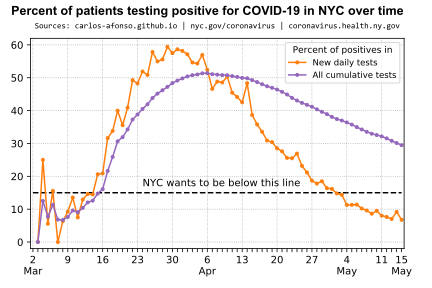
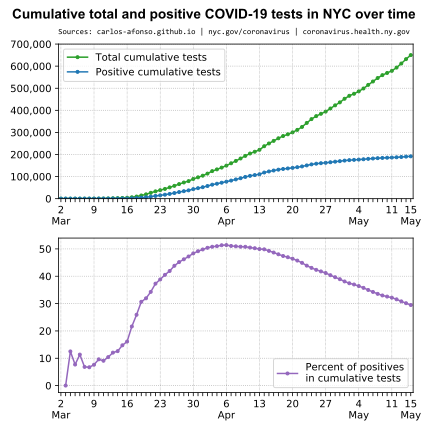
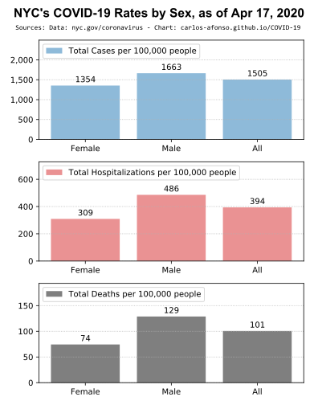

# Visualizing COVID-19 in NYC

<i>(Updated on April 13, 2020, by <a href="https://www.linkedin.com/in/carlos-afonso-w" target="&#95;blank" rel="noopener">Carlos Afonso</a>, a Data Scientist in NYC)</i>

Helping understand the evolution of the Coronavirus Disease 2019 (COVID-19) here in New York City (NYC), through data visualizations.

## 1. Percent of positive tests over time

The **"percent of positive COVID-19 tests over time"** is arguably the best metric to help understand the evolution of the disease here in NYC, because:
* It's a simple metric, defined as the *"number of people who tested positive for COVID-19"* divided by the *"number of all people tested for COVID-19"*.
  * Note: the result of this division is multiplied by 100 to transform it from a ratio to a percentage.
* By definition, this metric takes into consideration both the *"number of positive tests"* and the *"number of total tests"*. This is important because the number of (total) tests performed has not been constant over time.

The chart below shows two complementary versions of this important metric, namely:
* The **"percent of new daily positive COVID-19 tests by test date"** (in orange) defined as the *"number of (new) people who tested positive for COVID-19 (on that day)"* divided by the *"number of all people tests for COVID-19 (on that day)"*. This version shows the short temporal trend (i.e., the daily fluctuations).
* The **"percent of cumulative positive COVID-19 tests as of test date"** (in purple) defined as the *"number of all people who tested positive for COVID-19 (up to that day)"* divided by the *"number of all people tests for COVID-19 (up to that day)"*. This version shows the long term trend.

Each of the two lines/metrics in the chart above is explained in more detail in the next two charts (sections 1.1 and 1.2).

### 1.1. Percent of new daily positive tests over time

The first of the two charts below shows both the *number of new daily total COVID-19 tests* (in green) and the *number of new daily positive COVID-19 tests* (in blue) *by test date*. There has been a progress increase in the number of total tests over time. The number of positives has grown along with the number of total tests (as expected). However, a piece of good news is that, when compared with the total tests (green line), the new positives (blue line) seems to have been growing at a lower pace recently. This important piece of information is captured in the second chart.

Indeed, the second chart shows the **percent of new daily positive COVID-19 tests by test date** (in orange) which is defined has the *number of new daily positive COVID-19 tests* divided by the *number of new daily total COVID-19 tests* (i.e., the ratio of the two lines in the first chart: the blue line divided by the green line) -- multiplied by 100 to transform the ratio into a percentage. Note how after an initial progressive increase, the percent of new positive tests (orange line) has been decreasing recently. This is the same piece of good news as in the first chart, but this second chart makes it more clear.

### 1.2. Percent of cumulative positive tests over time

## Total counts

Total COVID-19 counts in NYC:
* reported by the City (NYC Health), as of April 12, 5 pm:
  * 178,917 total tests
  * 104,410 total cases (58% of total tests)
  * 27,676 (estimated) total hospitalizations (27% of total cases)
  * 6,182 total deaths (5.9% of total cases)
* reported by the State (Health Data NY), as of April 11:
  * 204,398 total tests
  * 103,208 total cases (50% of total tests)

<!---
  * 6,898 total deaths (as of April 12, 12:30 pm)
--->

Note: The City (NYC Health) and the State (Health Data NY) counts are different because they use different reporting methodologies.

<!---
The State is faster in including new counts in its data reports but less accurate in the date attribution. While the City is more accurate in the date attribution but slower in including new counts in its data (because it takes extra time to do a better date attribution). Because of this, for data released on the same day, the State counts are usually higher than the City counts.
--->

## New daily cases, hospitalizations, and deaths

<!---

--->

<!---
### NYC cases over Time

The number of total cases is expected to have an initial (potentially rapid) increase until it reaches a plateau. Nevertheless, some of the substantial increases in the number of cases may be at least partially explained by an increase in the testing capacity. For example, on March 17, a [news release from the Office of the Mayor](https://www1.nyc.gov/office-of-the-mayor/news/160-20/mayor-de-blasio-nyc-health-hospitals-bioreference-laboratories-expanded-capacity-to) announced an increase in the testing capacity in NYC, to allow 5,000 daily COVID-19 tests (starting March 19). So, some of the significant increases in the number of cases in the first days after March 19 may be partially explained by this new increased testing capacity.

--->

## Rates

### Rates by Age Group

<!---
The large majority (98%) of the deaths were in people with underlying conditions (Diabetes, Lung Disease, Cancer, Immunodeficiency, Heart Disease, Hypertension, Asthma, Kidney Disease, or GI/Liver Disease.)
--->

<!---

--->

### Rates by Sex

The charts below show NYC's COVID-19 rates by sex. More specifically the case rates, the hospitalization rates, and the death rates for each sex category (female, male, and all/everyone). Note that the rate is defined as the total count per 100,000 people. For example, the female case rate is defined as the total number of female COVID-19 cases in NYC per 100,000 females in NYC.

The charts indicate that all COVID-19 rates (case, hospitalization, and death) are higher in males than in females. Moreover, the male/female relative difference grows from the case rate to the hospitalization rate to the death rate.

<!---
Currently (Apr 6, 2020) there are 31,319 total female COVID-19 cases in NYC and it's estimated that the female population in NYC is around 4.4. million, thus the female COVID-19 rate is 713 per 100,000 people.
--->

<!---
### NYC cases by Borough

--->

## Notes

### Important Data Notes

The data presented here is sourced from the New York State Department of Health (Health Data NY), and the New York City Department of Health (NYC Health). The data details and limitations of the data are discussed below.

The data presented here is sourced from the New York City Department of Health (NYC Health) and the New York State Department of Health (Health Data NY) -- the links are presented below.

Both data sources are usually updated on a daily basis. I try to update this webpage every night, with the latest end-of-day date.

The data used to create the charts above is collected from the "COVID-19 Daily Data Summary" updates available on the [NYC Health COVID-19 webpage](https://www1.nyc.gov/site/doh/covid/covid-19-main.page){:target="&#95;blank" rel="noopener"}.

The data includes information about (only) the confirmed cases of people who tested positive for COVID-19 in NYC.

Due to public health guidance that people with mild illness stay home, the data may not reflect the true number of all positive COVID-19 cases in NYC.

The data is preliminary and subject to change as cases continue to be investigated. It may take several days to get the result of a test.

The data includes all cases treated in NYC, regardless of residence status. Nevertheless, it seems reasonable to assume that the large majority of the cases are NYC residents.

### Official Data and Information Sources

New York City Department of Health (NYC Health):
* [COVID-19 homepage](https://www1.nyc.gov/site/doh/health/health-topics/coronavirus.page){:target="&#95;blank" rel="noopener"}
* [COVID-19 data homepage](https://www1.nyc.gov/site/doh/covid/covid-19-data.page){:target="&#95;blank" rel="noopener"}
* [COVID-19 data archive](https://www1.nyc.gov/site/doh/covid/covid-19-data-archive.page)
* [COVID-19 data and technical notes on Github](https://github.com/nychealth/coronavirus-data)
* [COVID-19 public health milestones](https://www1.nyc.gov/site/doh/covid/covid-19-goals.page)

Office of the Mayor of New York City:
* [Latest News](https://www1.nyc.gov/office-of-the-mayor/news.page){:target="&#95;blank" rel="noopener"}

New York State Department of Health:
* [COVID-19 homepage](https://coronavirus.health.ny.gov){:target="&#95;blank" rel="noopener"}
* [Statewide COVID-19 testing data (Health Data NY)](https://health.data.ny.gov/Health/New-York-State-Statewide-COVID-19-Testing/xdss-u53e){:target="&#95;blank" rel="noopener"}
* [COVID-19 tracker (map)](https://covid19tracker.health.ny.gov/views/NYS-COVID19-Tracker/NYSDOHCOVID-19Tracker-Map){:target="&#95;blank" rel="noopener"}
* [Press releases](https://health.ny.gov/press/releases/2020/index.htm){:target="&#95;blank" rel="noopener"}

---

This webpage is part of the [COVID-19 open-source GitHub project](https://github.com/carlos-afonso/COVID-19){:target="&#95;blank" rel="noopener"}, created by [Carlos Afonso](https://www.linkedin.com/in/carlos-afonso-w){:target="&#95;blank" rel="noopener"}, a Data Scientist in NYC.
