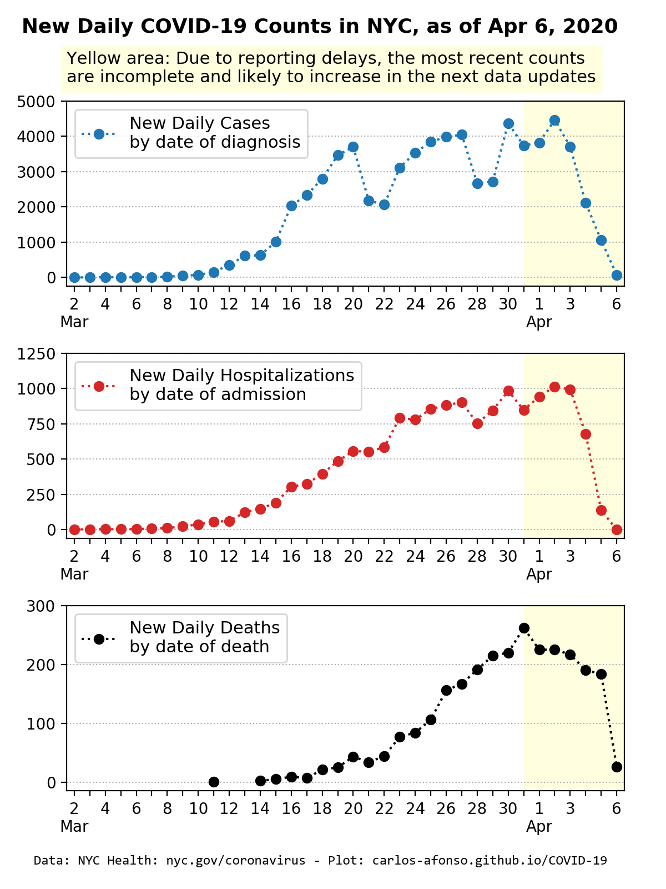
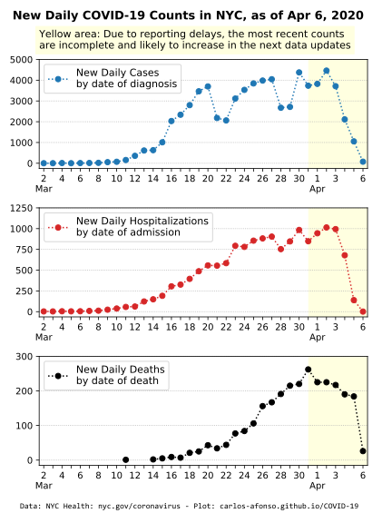

# Visualizing COVID-19

(Updated by <a href="https://www.linkedin.com/in/carlos-afonso-w" target="&#95;blank" rel="noopener">Carlos Afonso</a> on April 6, 2020)

Visualizing the Coronavirus Disease 2019 (COVID-19), particularly in New York City (NYC).

## New York City (NYC)

### NYC latest counts

April 6, 2020, 5:00 pm: Total COVID-19 counts in NYC:
* 68,776 total cases
* 15,333 total (estimated) hospitalizations (22% of total cases)
* 2,738 total deaths (4.0% of total cases)

<!---
April 4, 2020, 5:00 pm: Total COVID-19 counts in NYC:
* 104,096 total tests
* 60,850 total cases (58% of total tests)
* 12,716 total (estimated) hospitalizations (21% of total cases)
* 2,254 total deaths (3.7% of total cases)
--->

<!---
The large majority (98%) of the deaths were in people with underlying conditions (Diabetes, Lung Disease, Cancer, Immunodeficiency, Heart Disease, Hypertension, Asthma, Kidney Disease, or GI/Liver Disease.)
--->

The numbers above and the data used to create the charts below were collected from the [NYC Health COVID-19 data page](https://www1.nyc.gov/site/doh/covid/covid-19-data.page){:target="&#95;blank" rel="noopener"}

### NYC new daily counts

<!---

--->

<!---
### NYC cases over Time

The number of total cases is expected to have an initial (potentially rapid) increase until it reaches a plateau. Nevertheless, some of the substantial increases in the number of cases may be at least partially explained by an increase in the testing capacity. For example, on March 17, a [news release from the Office of the Mayor](https://www1.nyc.gov/office-of-the-mayor/news/160-20/mayor-de-blasio-nyc-health-hospitals-bioreference-laboratories-expanded-capacity-to) announced an increase in the testing capacity in NYC, to allow 5,000 daily COVID-19 tests (starting March 19). So, some of the significant increases in the number of cases in the first days after March 19 may be partially explained by this new increased testing capacity.

--->

### NYC cases by Age Group

### NYC rates by Sex

The charts below show NYC's COVID-19 rates by sex. More specifically the case rates, the hospitalization rates, and the death rates for each sex category (female, male, and all/everyone). Note that the rate is defined as the total count per 100,000 people. For example, the female case rate is defined as the total number of female COVID-19 cases in NYC per 100,000 females in NYC.

The charts indicate that all COVID-19 rates (case, hospitalization, and death) are higher in males than in females. Moreover, the male/female relative difference grows from the case rate (933/713 = 1.3) to the hospitalization rate (229/140 = 1.6) to the death rate (43/23 = 1.9). 

<!---
Currently (Apr 6, 2020) there are 31,319 total female COVID-19 cases in NYC and it's estimated that the female population in NYC is around 4.4. million, thus the female COVID-19 rate is 713 per 100,000 people.
--->

### NYC cases by Borough

### NYC official data and information sources

New York City Department of Health (aka, NYC Health):
* [COVID-19 webpage](https://www1.nyc.gov/site/doh/health/health-topics/coronavirus.page){:target="&#95;blank" rel="noopener"}
* [COVID-19 Daily Data Summary - Total Cases](https://www1.nyc.gov/assets/doh/downloads/pdf/imm/covid-19-daily-data-summary.pdf){:target="&#95;blank" rel="noopener"}
* [COVID-19 Daily Data Summary - Deaths](https://www1.nyc.gov/assets/doh/downloads/pdf/imm/covid-19-daily-data-summary-deaths.pdf){:target="&#95;blank" rel="noopener"}
* [COVID-19 Daily Data Summary - Hospitalizations](https://www1.nyc.gov/assets/doh/downloads/pdf/imm/covid-19-daily-data-summary-hospitalizations.pdf){:target="&#95;blank" rel="noopener"}
* [Percent of Patients Testing Positive by Neighborhood in NYC](https://www1.nyc.gov/assets/doh/downloads/pdf/imm/covid-19-data-map.pdf){:target="&#95;blank" rel="noopener"}

New York State Department of Health:
* [COVID-19 webpage](https://coronavirus.health.ny.gov){:target="&#95;blank" rel="noopener"}
* [County Breakdown of Positive COVID-19 Cases](https://coronavirus.health.ny.gov/county-county-breakdown-positive-cases){:target="&#95;blank" rel="noopener"}
* [Press Releases](https://health.ny.gov/press/releases/2020/index.htm){:target="&#95;blank" rel="noopener"}

Office of the Mayor of New York City:
* [Latest News](https://www1.nyc.gov/office-of-the-mayor/news.page){:target="&#95;blank" rel="noopener"}

### NYC data notes

The data used to create the charts above is collected from the "COVID-19 Daily Data Summary" updates available on the [NYC Health COVID-19 webpage](https://www1.nyc.gov/site/doh/covid/covid-19-main.page){:target="&#95;blank" rel="noopener"}.

The data includes information about (only) the confirmed cases of people who tested positive for COVID-19 in NYC.

Due to public health guidance that people with mild illness stay home, the data may not reflect the true number of all positive COVID-19 cases in NYC.

The data is preliminary and subject to change as cases continue to be investigated. It may take several days to get the result of a test.

The data includes all cases treated in NYC, regardless of residence status. Nevertheless, it seems reasonable to assume that the large majority of the cases are NYC residents.

NYC Health usually updates the data twice a day, once in the morning (11 am) and once in the evening (7 pm). I try to update this webpage every night so that the plots show the evening (end-of-day) data. Each plot explicitly states the date/time of the data being displayed.

---

This webpage is part of the [COVID-19 open-source GitHub project](https://github.com/carlos-afonso/COVID-19){:target="&#95;blank" rel="noopener"}, created by [Carlos Afonso](https://www.linkedin.com/in/carlos-afonso-w){:target="&#95;blank" rel="noopener"}.
