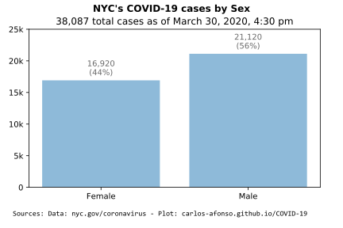

# Visualizing COVID-19

(Updated by <a href="https://www.linkedin.com/in/carlos-afonso-w" target="&#95;blank" rel="noopener">Carlos Afonso</a> on March 28, 2020)

Visualizing the Coronavirus Disease 2019 (COVID-19), particularly in New York City (NYC).

## New York City (NYC)

### Important notes

It's important to keep the following points in mind when looking at the data/plots below about the COVID-19 situation in NYC:

* The data is collected from the "COVID-19 Daily Data Summary" updates available on the [NYC Health COVID-19 webpage](https://www1.nyc.gov/site/doh/covid/covid-19-main.page){:target="&#95;blank" rel="noopener"}. I appreciate NYC Health's great work in tracking and providing this important data, with frequent updates. This is probably one of the best quality COVID-19 data across all of the United States.

* The data includes information about (only) the confirmed cases of people who tested positive for COVID-19 in NYC.

* Due to public health guidance that people with mild illness stay home, the data may not reflect the true number of all positive COVID-19 cases in NYC.

* The data contains information about the number of cases, hospitalizations, and deaths, with breakdowns by age group, sex, and borough.

* The data is preliminary and subject to change as cases continue to be investigated. It may take several days to get the result of a test.

* The data includes all cases treated in NYC, regardless of residence status. Nevertheless, it seems reasonable to assume that the large majority of the cases are NYC residents.

* NYC Health usually updates the data twice a day, once in the morning (11 am) and once in the evening (7 pm). I try to update this webpage every night so that the plots show the evening (end-of-day) data. Each plot explicitly states the date/time of the data being displayed.

### NYC latest numbers

Total COVID-19 counts in NYC, as of **March 28, 2020, 4:00 pm**, collected from the [NYC Health COVID-19 webpage](https://www1.nyc.gov/site/doh/covid/covid-19-main.page){:target="&#95;blank" rel="noopener"}:
* 30,765 total cases
* 6,287 total hospitalizations (20% of total cases)
* 672 total deaths (2.2% of total cases)

### NYC cases over Time

The number of total cases is expected to have an initial (potentially rapid) increase until it reaches a plateau. Nevertheless, some of the substantial increases in the number of cases may be at least partially explained by an increase in the testing capacity. For example, on March 17, a [news release from the Office of the Mayor](https://www1.nyc.gov/office-of-the-mayor/news/160-20/mayor-de-blasio-nyc-health-hospitals-bioreference-laboratories-expanded-capacity-to) announced an increase in the testing capacity in NYC, to allow 5,000 daily COVID-19 tests (starting March 19). So, some of the significant increases in the number of cases in the first days after March 19 may be partially explained by this new increased testing capacity.

### NYC cases by Age Group

### NYC cases by Sex

### NYC cases by Borough

### NYC official data and information sources

New York City Department of Health (aka, NYC Health):
* [COVID-19 webpage](https://www1.nyc.gov/site/doh/health/health-topics/coronavirus.page){:target="&#95;blank" rel="noopener"}
* [COVID-19 Daily Data Summary - Total Cases](https://www1.nyc.gov/assets/doh/downloads/pdf/imm/covid-19-daily-data-summary.pdf){:target="&#95;blank" rel="noopener"}
* [COVID-19 Daily Data Summary - Deaths](https://www1.nyc.gov/assets/doh/downloads/pdf/imm/covid-19-daily-data-summary-deaths.pdf){:target="&#95;blank" rel="noopener"}
* [COVID-19 Daily Data Summary - Hospitalizations](https://www1.nyc.gov/assets/doh/downloads/pdf/imm/covid-19-daily-data-summary-hospitalizations.pdf){:target="&#95;blank" rel="noopener"}
* [Percent of Patients Testing Positive by Neighborhood in NYC](https://www1.nyc.gov/assets/doh/downloads/pdf/imm/covid-19-data-map.pdf){:target="&#95;blank" rel="noopener"}

New York State Department of Health:
* [COVID-19 webpage](https://coronavirus.health.ny.gov){:target="&#95;blank" rel="noopener"}
* [County Breakdown of Positive COVID-19 Cases](https://coronavirus.health.ny.gov/county-county-breakdown-positive-cases){:target="&#95;blank" rel="noopener"}
* [Press Releases](https://health.ny.gov/press/releases/2020/index.htm){:target="&#95;blank" rel="noopener"}

Office of the Mayor of New York City:
* [Latest News](https://www1.nyc.gov/office-of-the-mayor/news.page){:target="&#95;blank" rel="noopener"}

The data used to create the charts above was collected from the New York City Health Department's [COVID-19 Daily Data Summary](https://www1.nyc.gov/assets/doh/downloads/pdf/imm/covid-19-daily-data-summary.pdf){:target="&#95;blank" rel="noopener"} updates.

---

This webpage is part of the [COVID-19 open-source GitHub project](https://github.com/carlos-afonso/COVID-19){:target="&#95;blank" rel="noopener"}, created by [Carlos Afonso](https://www.linkedin.com/in/carlos-afonso-w){:target="&#95;blank" rel="noopener"}.
